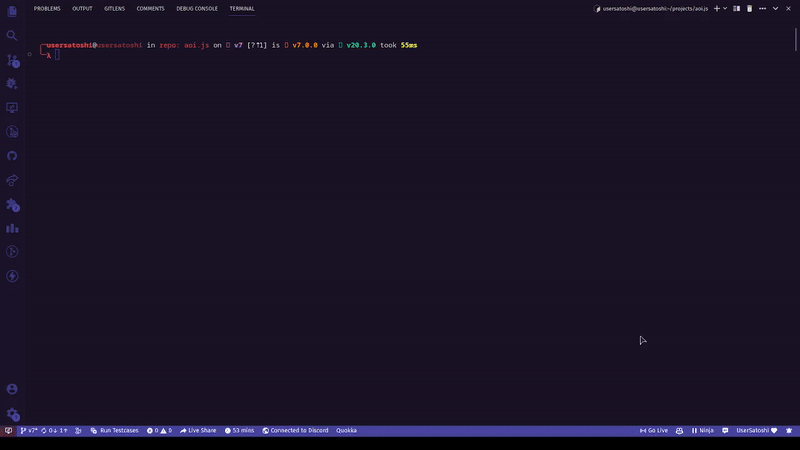
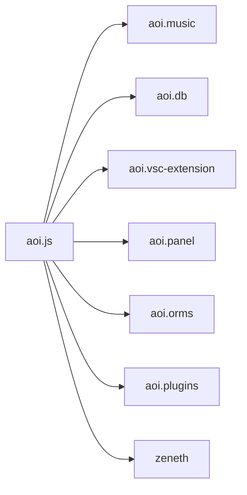

<p align="center">
  <a href="https://aoi.js.org">
    
  </a>
</p>

<div align="center">
  <b>The most powerful string package to create a simple and fast Discord Bot.</b>
</div>

---
<br/>

<div align="center">

[![NPM downloads][download-image]][download-url] &nbsp; &nbsp; 
[![AoiJS Server][aoijs-server]][aoijs-server-url] &nbsp; &nbsp;
[![NPM version][npm-image]][npm-url] &nbsp; &nbsp; 
 &nbsp; &nbsp;
 &nbsp; &nbsp;


  


[npm-image]: http://img.shields.io/npm/v/aoi.js.svg?color=42cfff
[npm-url]: http://npmjs.org/package/aoi.js
[download-image]: https://img.shields.io/npm/dt/aoi.js.svg?color=3182b0
[download-url]: https://npmjs.org/package/aoi.js
[aoijs-server]: https://img.shields.io/discord/773352845738115102?color=5865F2&logo=discord&logoColor=white
[aoijs-server-url]: https://aoi.js.org/invite

  </div>

<br />

<div align = "center">

  **[ Documentation ](https://aoi.js.org/docs/)** | **[ Support Server ](https://aoi.js.org/invite)** | **[ Website ](https://aoi.js.org/)** | **[ NPM ](https://npmjs.org/package/aoi.js)** | **[ GitHub ](
  https://github.com/akaruidevelopment/aoi.js)**
  
</div>

---

## About

aoi.js is a JavaScript library that is designed to make it easy to build Discord bots. 

It is open-source and free to use, and provides a simple, easy-to-use interface for interacting with the Discord API and handling events. 

aoi.js is suitable for beginners who are new to building bots, as well as experienced developers who want to save time and streamline their workflow.

## Features

- **600+ pre-built functions** to work around
- **Custom, easier to use language** to code your bots in
- Custom file extension `.aoi` to support the language
- **Built-in [custom local database](https://github.com/akaruidevelopment/aoi.db)** as well as support popular databases like mongodb, sql etc;
- **Command transpilation** to javascript to speed up command execution
- **Extensions to support** aoi.js like aoi.music, vsc-extension, etc;
- **Custom cli** to help you from setups, templates etc;


## Installation

> * **NodeJs Version : LTS ( v18 )**

```bash
### npm
npm i aoi.js
```
```bash
### yarn
yarn add aoi.js
```

## Setup 

> We recommend using the aoi.js cli to setup your bot


```bash
### for commonjs
aoijs -n 
```
```bash
### for esm
aoijs -n --esm 
```

#### Gif Tutorial

> * Tutorial is for esm and will create project in tests/src folder. not providing a folder will create project in current directory

<br />




### Manual Setup

```javascript
// imports
const { AoiClient,defaultCacheConfig } = require("aoi.js");
const { Intents } = require("aoiluna");

// create a new client
const bot = new AoiClient({
  token: "TOKEN",
  prefixes: "PREFIX",
  intents: Intents.Guilds | Intents.GuildMessages | Intents.MessageContent,
  events: ['MessageCreate','Ready'],
  caches: defaultCacheConfig(),
})

// create a command
bot.command({
  name: "ping",
  code: `Pong! $pingms`
})
```

## Extensions



## Contributing

We welcome contributions from anyone and everyone. 

Please see our [contributing guide](./.github/CONTRIBUTING.md) for more information.


## License

aoi.js is licensed under the [Apache License 2.0](./LICENSE).

## Our ♥️ Contributors

<a href="https://github.com/Akaruidevelopment/aoi.js/graphs/contributors">
  
</a>
