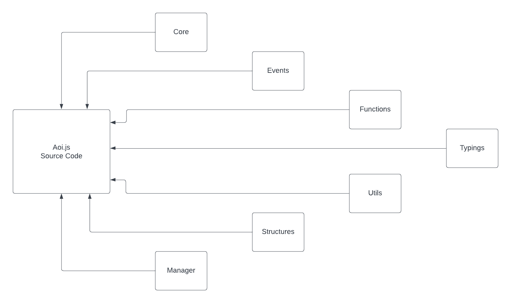

# Aoi.js Source

This is the source code for Aoi.js. It is written in TypeScript and compiled to JavaScript.

## Directory Structure

## Divisions

the `src` directory is divided into the following sections:

- `core` - this contains the transpiler for aoi.js functions and responsible for converting aoi.js command's code to executable javascript function.
  
- `events` - this contains the event handlers for aoi.js
  
- `functions` - this contains the functions for aoi.js
  
- `manager` - this contains the various managers for aoi.js handling various modules
  
- `structures` - this contains the various classes for aoi.js
  
- `typings` - this contains the typings for aoi.js
  
- `utils` - this contains the various utility functions for aoi.js

## [pack.js](./pack.js)

responsible for the adding package.json to the `dist/cjs` and `dist/esm` directories.

## [index.ts](./index.ts)

the main entry point for aoi.js