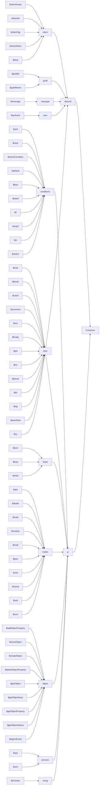

# Functions

## Directory Structure

```mermaid
graph LR;
discord --> Functions;
js --> Functions;
client --> discord;
guild --> discord;
message --> discord;
misc --> discord;
user --> discord;
conditions --> js;
loops --> js;
maths --> js;
misc --> js;
object --> js;
process --> js;
string --> js;
$clientAvatar --> client;
$clientId --> client;
$clientTag --> client;
$clientToken --> client;
$ping --> client;
$guildId --> guild;
$guildName --> guild;
$message --> message;
$eval --> misc;
$authorId --> user;
$and --> conditions;
$case --> conditions;
$checkCondition --> conditions;
$default --> conditions;
$else --> conditions;
$elseif --> conditions;
$if --> conditions;
$onlyif --> conditions;
$or --> conditions;
$switch --> conditions;
$forIn --> loops;
$loop --> loops;
$while --> loops;
$abs --> maths;
$divide --> maths;
$math --> maths;
$modulo --> maths;
$multi --> maths;
$pow --> maths;
$root --> maths;
$round --> maths;
$sub --> maths;
$sum --> maths;
$break --> misc;
$catch --> misc;
$comment --> misc;
$env --> misc;
$finally --> misc;
$get --> misc;
$inc --> misc;
$jseval --> misc;
$let --> misc;
$log --> misc;
$passData --> misc;
$try --> misc;
$addObjectProperty --> object;
$cloneObject --> object;
$createObject --> object;
$deleteObjectProperty --> object;
$getObject --> object;
$getObjectKeys --> object;
$getObjectProperty --> object;
$getObjectValues --> object;
$objectExists --> object;
$cpu --> process;
$ram --> process;
$includes --> string;
```

## Divisions

 - `discord`: Contains functions related to discord
 - `js`: Contains functions related to js
