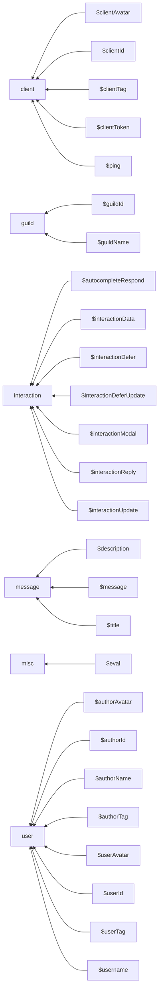

# Discord

## Directory Structure

## Divisions

 - `client`: Contains functions related to client
 - `guild`: Contains functions related to guild
 - `interaction`: Contains functions related to interaction
 - `message`: Contains functions related to message
 - `misc`: Contains functions related to misc
 - `user`: Contains functions related to user
