# JavaScript

## Directory Structure

```mermaid
graph RL;
$arrayAt --> array;
$arrayConcat --> array;
$arrayCreate --> array;
$arrayEvery --> array;
$arrayFilter --> array;
$arrayFind --> array;
$arrayForEach --> array;
$arrayIncludes --> array;
$arrayIndexOf --> array;
$arrayJoin --> array;
$arrayLastIndexOf --> array;
$arrayLength --> array;
$arrayMap --> array;
$arrayPop --> array;
$and --> conditions;
$case --> conditions;
$checkCondition --> conditions;
$default --> conditions;
$else --> conditions;
$elseif --> conditions;
$if --> conditions;
$onlyif --> conditions;
$or --> conditions;
$switch --> conditions;
$forIn --> loops;
$loop --> loops;
$while --> loops;
$abs --> maths;
$divide --> maths;
$math --> maths;
$modulo --> maths;
$multi --> maths;
$pow --> maths;
$root --> maths;
$round --> maths;
$sub --> maths;
$sum --> maths;
$break --> misc;
$catch --> misc;
$comment --> misc;
$env --> misc;
$finally --> misc;
$get --> misc;
$inc --> misc;
$jseval --> misc;
$let --> misc;
$log --> misc;
$passData --> misc;
$try --> misc;
$useComponent --> misc;
$addObjectProperty --> object;
$cloneObject --> object;
$createObject --> object;
$deleteObjectProperty --> object;
$getObject --> object;
$getObjectKeys --> object;
$getObjectProperty --> object;
$getObjectValues --> object;
$objectExists --> object;
$cpu --> process;
$ram --> process;
$includes --> string;
$toString --> string;

```

## Divisions

 - `array`: Contains functions related to array
 - `conditions`: Contains functions related to conditions
 - `loops`: Contains functions related to loops
 - `maths`: Contains functions related to maths
 - `misc`: Contains functions related to misc
 - `object`: Contains functions related to object
 - `process`: Contains functions related to process
 - `string`: Contains functions related to string;
